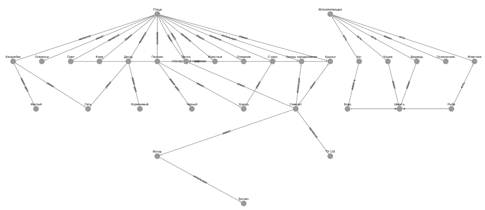
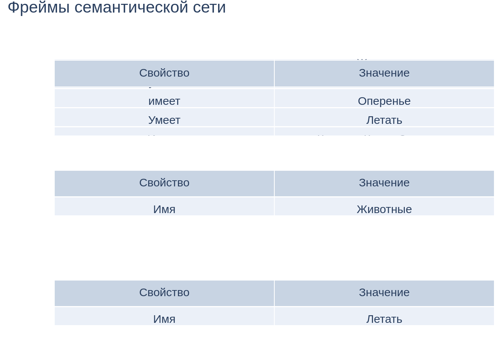

# Semantic network visualization 

A semantic network, or frame network, is a knowledge base that represents semantic relations between concepts in a network. This is often used as a form of knowledge representation.

This repository is an old project of mine and an attempt to create a visualization of an example semantic network. Results are in the images below.

Semantic Network:


Network Frames:



## Run on NixOs

```shell
  nix develop --impure
```  

Then navigate to http://127.0.0.1:8060/

## Dependencies

* dash
* dash-cytoscape
* tabulate
